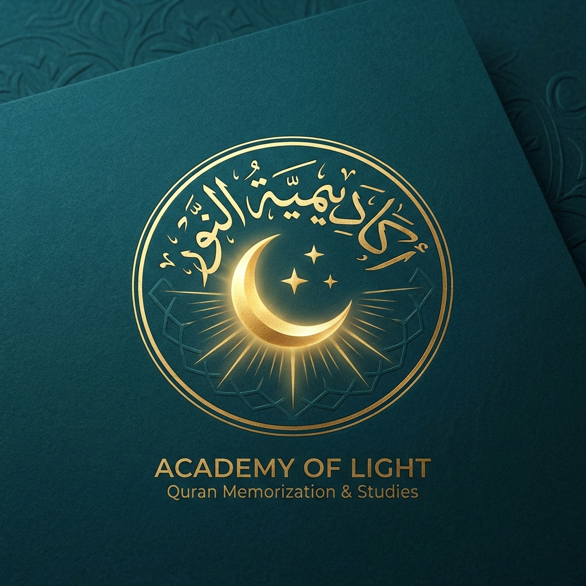

# 🌙 أكاديمية النور لحفظ القرآن الكريم | Nora Quran Academy

<div align="center">



**Modern RTL Arabic Landing Page for Online Quran Memorization**

[](https://lolotam.github.io/nora/)
[](https://developer.mozilla.org/en-US/docs/Web/HTML)
[](https://developer.mozilla.org/en-US/docs/Web/CSS)
[](https://developer.mozilla.org/en-US/docs/Web/JavaScript)

</div>

---

## 📖 نبذة عن الأكاديمية | About

**أكاديمية النور لحفظ القرآن الكريم** هي أكاديمية متخصصة في تعليم وتحفيظ القرآن الكريم أونلاين، تحت إشراف المعلمة **نوره عبدالواحد محمد الزغبي**، الحاصلة على شهادات معتمدة من الجامع الأزهر الشريف.

**Nora Quran Academy** is an online Quran memorization academy led by **Noura Abdel Wahid Mohamed Al-Zoghbi**, a certified teacher from Al-Azhar Al-Sharif, offering professional Quran teaching for students across Egypt and the Gulf region.

---

## ✨ المميزات | Features

### 🎓 Teacher Qualifications
- ✅ **حفظ القرآن الكريم كاملاً** - Complete Quran memorization certificate from Al-Azhar (80%)
- ✅ **شهادة التجويد والقراءات** - Tajweed and Qira'at certificate from Al-Azhar (80%)
- ✅ **إجازة دورة التصحيح والإتقان** - Recited entire Quran in one session (3 hours)
- ✅ Studied under **Dr. Alaa Al-Rifai Al-Jazzar**

### 📚 Program Features
- 🕌 Quran memorization with proper Tajweed
- 🎤 Pronunciation and recitation correction
- 🔄 Regular review of memorized portions
- 🎯 **70% memorization** of new pages per session
- 👤 Individual one-on-one sessions (1 hour each)
- 🎁 **Free trial session**
- 💻 Online teaching via Telegram or Messenger

### 🌍 International Students
Teaching students from:
- 🇪🇬 Egypt
- 🇶🇦 Qatar
- 🇸🇦 Saudi Arabia
- 🇰🇼 Kuwait
- 🇧🇭 Bahrain
- 🇦🇪 UAE

---

## 🎨 Website Features

### Design Highlights
- 🌙 **Islamic Theme** - Authentic teal & gold color palette with Islamic geometric patterns
- 📱 **Fully Responsive** - Mobile-first design optimized for all devices
- ↔️ **RTL Support** - Complete right-to-left layout for Arabic
- ✨ **Smooth Animations** - Scroll-triggered animations and particle effects
- 🎯 **High Conversion** - Clear CTAs and WhatsApp integration

### Technical Stack
- **HTML5** - Semantic markup with SEO optimization
- **CSS3** - Custom design system with CSS variables
- **Vanilla JavaScript** - No framework dependencies
- **Google Fonts** - Amiri & Cairo Arabic fonts
- **Font Awesome** - Icon library

---

## 📦 Project Structure

```
nora/
├── index.html              # Main landing page
├── styles/
│   └── main.css           # Complete styling (Islamic theme)
├── scripts/
│   └── main.js            # Animations and interactions
└── assets/
    └── images/
        ├── hero_bg.png            # Islamic geometric pattern
        ├── quran_decorative.png   # Open Quran decoration
        ├── azhar_badge.png        # Al-Azhar badge
        ├── academy_logo.png       # Academy logo
        └── teacher_avatar.png     # Teacher avatar
```

---

## 🚀 Quick Start

### Option 1: Direct Download
```bash
# Clone the repository
git clone https://github.com/lolotam/nora.git

# Navigate to directory
cd nora

# Open in browser
start index.html  # Windows
open index.html   # macOS
xdg-open index.html  # Linux
```

### Option 2: Live Server (Recommended)
```bash
# Using VS Code Live Server extension
# Or using Python
python -m http.server 8000

# Or using Node.js http-server
npx http-server
```

Then visit: `http://localhost:8000`

---

## 📱 Sections Overview

### 1. 🎯 Hero Section
- Animated Islamic background
- Academy introduction
- Achievement statistics
- Primary CTA buttons

### 2. 📜 Qualifications Section
- Teacher profile
- Al-Azhar certifications
- Teaching experience
- International student base

### 3. ⭐ Features Section
- 8 program benefits
- Interactive hover effects
- Highlighted key feature (70% memorization rate)

### 4. 💎 Pricing Section
- 3 pricing packages (8, 12, 16 sessions/month)
- Popular package highlight
- Direct booking links

### 5. 📞 Contact Section
- WhatsApp direct link
- Telegram integration
- Messenger option
- Location information

### 6. 📄 Footer
- Quick links
- Social media
- Quranic verse

---

## 🎨 Color Palette

| Color | Hex | Usage |
|-------|-----|-------|
| Deep Teal | `#0d4f4f` | Primary background, headers |
| Gold | `#d4af37` | Accents, highlights, CTAs |
| Cream | `#f5f0e6` | Text backgrounds, cards |
| Emerald | `#1e8449` | Success states |
| Dark Brown | `#3d2914` | Text color |
| Light Mint | `#e8f5f0` | Section backgrounds |

---

## 📞 Contact Information

### المعلمة نوره عبدالواحد | Teacher Noura

- 📱 **Phone/WhatsApp:** [01091347498](https://wa.me/201091347498)
- 💬 **Telegram:** [@+201091347498](https://t.me/+201091347498)
- 📍 **Location:** كفر الشيخ، مركز كفر الزيات، محافظة الغربية، مصر
- 🕌 **Institution:** الجامع الأزهر الشريف

---

## 📦 Package Options

| Package | Sessions/Month | Details |
|---------|----------------|---------|
| 🌟 **Basic** | 8 sessions | 2 sessions/week, 1 hour each |
| 👑 **Standard** | 12 sessions | 3 sessions/week (Most Popular) |
| 🚀 **Intensive** | 16 sessions | 4 sessions/week, weekly reports |

**All packages include:**
- ✅ One-on-one sessions
- ✅ Tajweed correction
- ✅ Regular reviews
- ✅ Free trial session

---

## 🌐 Deployment

### GitHub Pages (Recommended)
1. Go to repository Settings
2. Navigate to Pages section
3. Select `main` branch as source
4. Save and wait for deployment
5. Visit: `https://lolotam.github.io/nora/`

### Netlify
[](https://app.netlify.com/start/deploy?repository=https://github.com/lolotam/nora)

### Vercel
[](https://vercel.com/new/clone?repository-url=https://github.com/lolotam/nora)

---

## 🔧 Browser Support

| Browser | Version |
|---------|---------|
| ✅ Chrome | 90+ |
| ✅ Firefox | 88+ |
| ✅ Safari | 14+ |
| ✅ Edge | 90+ |
| ✅ Mobile | iOS 12+, Android 8+ |

---

## 📄 License

© 2025 أكاديمية النور لحفظ القرآن الكريم. All rights reserved.

---

## 🤝 Contributing

This is a personal academy website. For inquiries about Quran memorization programs, please contact the teacher directly via WhatsApp.

---

## 🌟 Acknowledgments

- **Teacher:** نوره عبدالواحد محمد الزغبي
- **Mentor:** الدكتور علاء الرفاعي الجزار
- **Institution:** الجامع الأزهر الشريف
- **Design:** Islamic geometric patterns inspired by traditional Islamic art
- **Fonts:** Google Fonts (Amiri, Cairo)

---

<div align="center">

### ﴿ إِنَّا نَحْنُ نَزَّلْنَا الذِّكْرَ وَإِنَّا لَهُ لَحَافِظُونَ ﴾

**"Indeed, it is We who sent down the Quran and indeed, We will be its guardian."**  
*Surah Al-Hijr, Verse 9*

---

Made with 💚 for the love of Quran

[⬆ Back to Top](#-أكاديمية-النور-لحفظ-القرآن-الكريم--nora-quran-academy)

</div>
